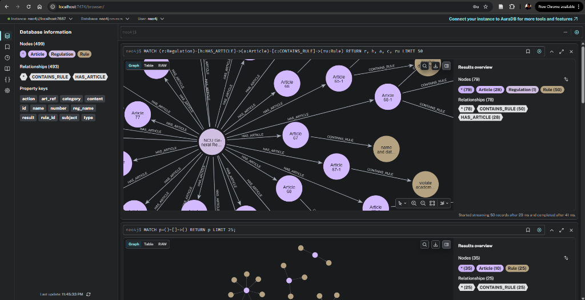

# Report: NCU Regulation Knowledge Graph and Quality Assurance System
**Name:** Robby Arifandri  
**Student ID:** 114522602

---

## Knowledge Graph Construction Logic and Design Choices

The central design principle of this project is the atomization of governance structures. Rather than treating regulations as monolithic text blocks, they are decomposed into structured, factual nodes.

### 1. The Rule Node Strategy
Unlike conventional Retrieval-Augmented Generation (RAG) systems that retrieve full articles, this architecture extracts and retrieves specific rules. 
- **Article nodes** preserve the structural context (number, content).
- **Rule nodes** capture the normative intent (subject, action, result).
- **Design Choice:** A local language model (`Qwen2.5-3B`) is utilized to extract these triplets during the construction phase. This methodology enables property-based retrieval (e.g., querying for all nodes where the `type` attribute equals 'penalty').

### 2. Schema Diagram
The knowledge graph adheres to the following hierarchical grounding structure:
`(:Regulation)-[:HAS_ARTICLE]->(:Article)-[:CONTAINS_RULE]->(:Rule)`

---

## Retrieval Strategy: Intent-Based Dual-Channel

The `query_system.py` module implements a comprehensive retrieval pipeline designed to balance precision and recall:

### Channel A: Typed Intent Query
The system initially performs intent parsing on the user's query to extract:
- `question_type`: (e.g., fee, penalty)
- `subject_terms`: (e.g., ['student ID'])
- `aspect`: (e.g., 'cost')

Subsequently, it executes a targeted Cypher query that filters by `Rule.type` and searches for specified entities within `Rule.subject` and `Rule.action`.

### Channel B: Broad Semantic Fallback
In cases where structured intent matching does not yield sufficient results, the system executes a broad full-text search across both `Rule` and `Article` content indices utilizing Neo4j's Lucene engine.

### Channel C: SQLite High-Recall Backup
Should the knowledge graph retrieval yield sparse results (fewer than five rules), the system initiates a keyword-based retrieval from the underlying SQLite `articles` table. This redundancy ensures that the raw source text remains available for grounding, mitigating the risk of extraction failures by the language model.

---

## Evaluation and Failure Analysis

The system was evaluated utilizing an automated testing framework (`auto_test.py`, functioning as an LLM-as-a-Judge) against 20 benchmark queries.

### Automated Test Results

```text
==============================
=== Evaluation Summary (No Metadata) ===
Total: 20
Passed: 13
Failed: 7
Accuracy: 65.0%
==============================
```


### Failure Categories and Analysis

| Category | Questions | Root Cause |
| :--- | :--- | :--- |
| **Knowledge Gap** | Q7, Q11 | The specific rules (e.g., precise credit requirements) were absent from the extracted rule set or necessitated cross-regulation associations that were not fully captured. |
| **Logic and Mathematical Reasoning** | Q15 | The language model encountered difficulties with cumulative arithmetic (e.g., aggregating multiple extension periods documented across disparate rules). |
| **Grounding Failure** | Q17, Q20 | Contextual Oversight: The relevant rules were present in the retrieved context; however, the model failed to identify them within a dense block of information. |
| **Ambiguity** | Q14 | The model accurately cited an edge-case rule but failed to prioritize the general case rule, which was ranked lower in the retrieval results. |

### Operational Fixes and Improvements
- **Cypher Robustness**: Implemented a text-sanitization layer to escape special characters (e.g., `/`) in user queries, thereby preventing Lucene lexical errors.
- **Synthesis Tuning**: Refined the generator prompt to be significantly more directive, compelling the model to conduct multiple passes over the context before defaulting to an "I don't know" response.

---

## Graph Visualization


*Figure 1: Visualization displaying Regulation (Blue), Article (Green), and extracted Rule nodes (Orange).*

---

## Getting Started

1. **Initialize Neo4j Database**: `docker run -d --name neo4j -p 7474:7474 -p 7687:7687 -e NEO4J_AUTH=neo4j/password neo4j:latest`
2. **Construct Knowledge Graph**: `python build_kg.py`
3. **Execute QA System**: `python query_system.py`
4. **Evaluate System Performance**: `python auto_test.py`
  


